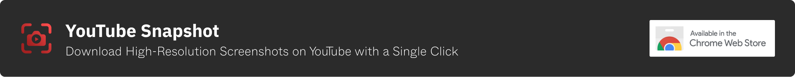

  

<h1 align="center">Youtube Snapshot</h1>

YouTube Snapshot is a lightweight Chrome extension that adds a Snapshot button to YouTube players, including embedded players. It lets you quickly capture a frame as an image or record a short GIF clip without leaving the page.

## Key Features

- **One-Click Snapshots**: Capture screenshots from the current video frame.
- **GIF Recording**: Start and stop GIF capture quickly with `g`.
- **Flexible Save Options**: Save captures as PNG/JPG and optionally copy images to clipboard.
- **Customizable Settings**: Configure quality, sound, frame rate, max GIF duration, and frame size.
- **Smart File Naming**: Uses video title and timestamp for easier organization.
- **Embedded Video Support**: Works on YouTube and supported embedded YouTube players.

## Repository Structure

| Script            | Role                                                                                                                            |
| ----------------- | ------------------------------------------------------------------------------------------------------------------------------- |
| `background.js`   | Creates the offscreen document when needed and relays runtime messages between tab and offscreen contexts.                      |
| `content.js`      | Runs in YouTube pages/embeds, injects snapshot UI, handles shortcuts, captures PNG/JPG frames, and starts/stops GIF recording.  |
| `gif-recorder.js` | Captures frames in a loop, sends frame data for encoding, receives progress/chunks, and finalizes GIF download.                 |
| `offscreen.js`    | Receives frames, coordinates GIF encoding through `gif.js` workers, and streams encoded chunks/progress back to the active tab. |
| `popup.js`        | Reads/writes `chrome.storage.sync` settings for snapshot and GIF preferences.                                                   |

## Privacy Policy

This Privacy Policy describes how the YouTube Snapshot Chrome extension ("the Extension") handles information.

### Information We Collect

The Extension does **not** collect, store, or transmit personal information, account credentials, browsing history, or captured media to external servers. All snapshot and GIF operations are performed locally in your browser context. Captured files are only saved based on your chosen actions (download and/or clipboard copy).

### Permissions and Why They Are Required

The Extension requests only the permissions needed for core functionality:

- **`storage`**: Stores your preferences, such as capture format, quality, sound effects, GIF frame rate, and duration.
- **`webNavigation`**: Detects and supports YouTube embeds and iframe contexts where standard page lifecycle hooks are insufficient.
- **`scripting`**: Injects runtime capture logic into supported YouTube player pages/frames.
- **Host permissions**: Allows the Extension to interact with supported YouTube player surfaces so capture controls can function.

### How Information Is Used

Any locally available context (for example, video title and timestamp) is used only to generate filenames and complete capture actions initiated by you. The Extension does not profile users, track activity across sites for analytics, or build behavioral records.

### Data Storage and Retention

- Preference data is saved in browser-managed extension storage (`chrome.storage.sync`).
- Captured images/GIFs are stored only where your browser saves downloads or where you paste clipboard content.
- The Extension does not maintain remote databases or cloud backups.

### Third-Party Sharing

The Extension does not sell, rent, or share personal data with third parties. No capture content is transmitted to third-party APIs, ad networks, or analytics providers by the Extension.

### Security

Because processing is local and no personal data pipeline is maintained by the Extension, exposure risk is minimized. The codebase is maintained to support intended behavior only, and permissions are scoped to functional requirements.

### Policy Updates

This Privacy Policy may be updated over time to reflect product, platform, or compliance changes. Updated policy text is published on the Extension's Chrome Web Store listing and/or repository documentation.

### Contact

If you have questions about this Privacy Policy, contact us through the Chrome Web Store listing.

**Effective Date:** October 12, 2024

## License

All rights reserved. Unauthorized copying, modification, distribution, or use of this project, via any medium, is strictly prohibited without prior written permission from the author.
