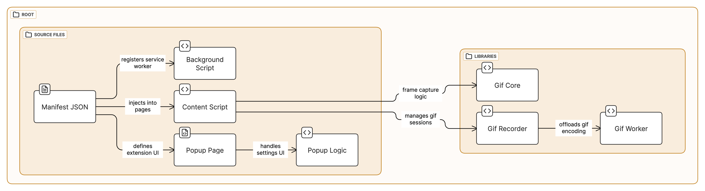

# Youtube Snapshot

Capture and Save YouTube Moments with Ease

This simple and lightweight extension adds a "Snapshot" button to the YouTube video player, allowing you to quickly capture and save any frame of a video as a PNG image or record a GIF of your favorite moments. Perfect for grabbing those meme-worthy moments, saving reference images, or creating thumbnails for your own videos.

## Key Features

- **One-Click Snapshots**: Easily capture screenshots with a single click.
- **GIF Recording**: Record short GIFs of your favorite moments with a simple keyboard shortcut.
- **Save to Your Computer**: Download those snazzy screenshots as PNGs or JPGs.
- **Copy to Clipboard**: Paste those pics anywhere you want!
- **Keyboard Shortcuts**:
  - Set up your own shortcut for lightning-fast captures
  - Press 'g' to start/stop recording a GIF
- **Smart File Names**: No more guessing games! Your screenshots and GIFs will have the video title and timestamp.
- **Simple Setup:** Get snapping in seconds!
- **Support for Embedded videos**: Works for both Youtube website and embedded videos

## Repository Structure and Script Flow

_This diagram shows the architecture and data flow of the YouTube Snapshot extension._

## Privacy Policy

This Privacy Policy describes how the YouTube Snapshot Chrome extension ("the Extension") handles your information.

**Information We Collect**\
The Extension does **not** collect, store, or transmit any personal information or browsing data. It operates solely within your browser and interacts only with the active YouTube video page.

**Permissions**\
The Extension requests the following permissions:

- **Storage**: This permission allows the extension to store user preferences for keyboard shortcuts and how snapshots are saved (to file or clipboard).
- **WebNavigation**: Since embedded iframes do not trigger the usual page load events that a standard content script relies on, webNavigation is necessary to identify and access these embedded videos dynamically.
- **Scripting**: This is essential for interacting with the YouTube video controls inside the iframe and injecting the snapshot button. Without scripting, the extension would be unable to dynamically inject content.js into iframes.
- **Host permissions**: This permission allows the extension to interact with the YouTube video player from any website and enable the snapshot functionality.

**How We Use Information**\
The Extension uses the granted permissions solely to enable its core functionality: capturing a snapshot of the current YouTube video frame and saving it as an image file on your local device, or recording a GIF of the video. No data is transmitted or stored outside of your browser.

**Third-Party Sharing**\
The Extension does not share any information with third-party services or websites.

**Data Security**\
Since the Extension does not collect or store any user data, there is no user data to secure. However, the Extension's code is regularly reviewed to ensure it functions as intended and does not pose any security risks.

**Changes to this Privacy Policy**\
This Privacy Policy may be updated from time to time. Any updates will be posted on the Extension's page on the Chrome Web Store.

**Contact Us**\
If you have any questions or concerns about this Privacy Policy, please contact us through the Chrome Web Store.

**Effective Date:** October 12, 2024

